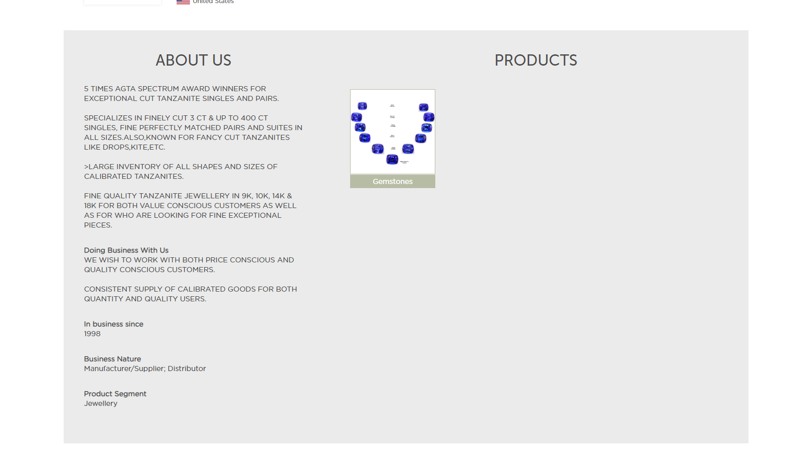

## Jewellerynet Crawler

### Info

> Developed with Scrapy and Selenium for production ready project

### Screenshot


Spider click each page to extract detail value



Exported a clean csv with all available exhibitors information

### Installation and Running

Must have scrapy

> Open jewellerynet.py and check the line 30 and change webdriver path for your local machine

```
pip install requests selenium lxml openpyxl
```

```
git clone https://github.com/mpalashb/jewellerynet_com
cd jewellerynet_com
scrapy crawl jewellerynet
```
